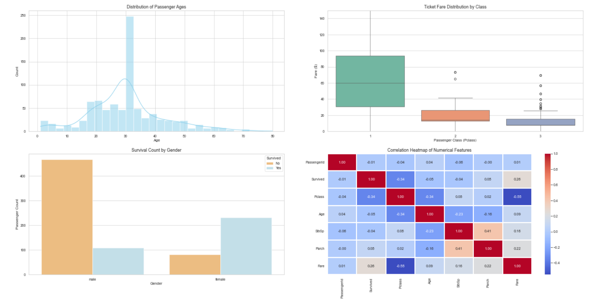

# Task 2 — Titanic Dataset: Missing Values, Outliers & Visualizations

## Overview
This task builds on the Titanic dataset EDA from Task 1. It focuses on handling missing values, detecting outliers, creating visualizations, and drawing conclusions about which feature most affects survival.

## Tools Used
- Python
- pandas, NumPy
- matplotlib, seaborn

## Steps Performed

### 1. Handling Missing Values
Checked missing values with `.isna().sum()`:

| Column   | Missing Values |
|----------|-----------------|
| Age      | 177 |
| Cabin    | 687 |
| Embarked | 2 |

- **Embarked**: Filled with the mode, since only 2 values are missing — too small to meaningfully affect the data either way, but dropping rows was avoided to keep all passenger records intact.
- **Age**: A few extreme outliers (age < 1) were dropped first, then remaining missing values were filled with the mean age (rounded up). Mean was chosen over median since the distribution, after removing outliers, was reasonably close to normal.
- **Cabin**: Filled with `"Unknown"` instead of dropping, since ~77% of values are missing — dropping the column or rows would lose too much data. Keeping it as a distinct category preserves the information that cabin data wasn't recorded, which may itself be meaningful.

### 2. Outlier Detection
Used a boxplot on the `Age` column to visualize spread and outliers.

- Min age: 0.42
- Max age: 80
- Median age: 28.0
- Mean age: 30.0
- Found 7 records with age < 1 (infants), treated as outliers and dropped before imputing missing values.

### 3. Visualizations
Created at least 4 visualizations using matplotlib and seaborn:
- **Histogram** — distribution of passenger ages
- **Boxplot** — age distribution and outliers
- **Bar chart** — survival counts across a categorical feature
- **Correlation heatmap** — relationships between numerical features

### 4. Correlation Analysis
Computed the correlation matrix using `data.corr(numeric_only=True)`.

## Findings: Which Feature Most Affects Survival?
**Pclass** shows the strongest correlation with survival among numerical features, at approximately **-0.33** — the strongest of any feature in the correlation matrix. This negative correlation suggests that passengers in lower-numbered classes (1st class) had a notably higher chance of survival than those in 3rd class, likely due to factors like cabin location, proximity to lifeboats, and priority during evacuation.
